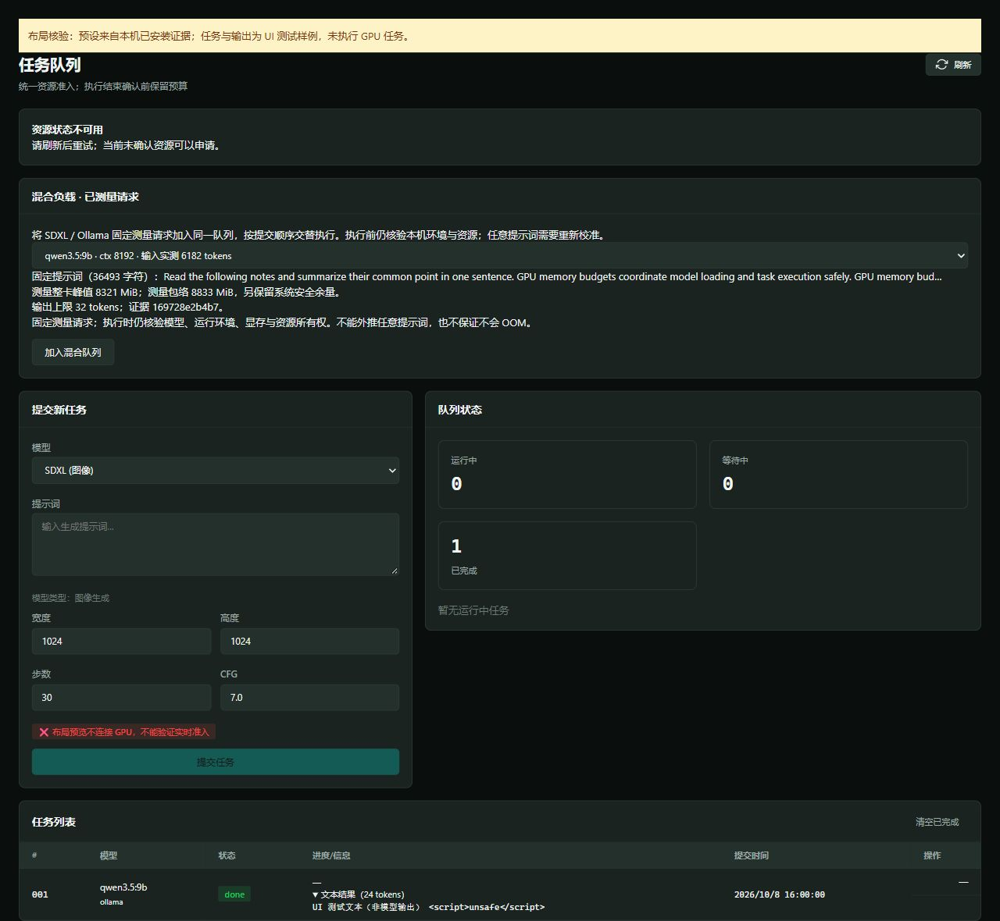

# 混合负载的已测量请求入口

## 实现与边界

队列页面提供 SDXL / Ollama 已测量预设，统一加入原持久队列。选择器显示固定提示词片段、参数、实测整卡峰值、包络与证据摘要；任务列表显示后端，并可展开持久化的 Ollama 文本结果。模型输出与目录文本经 HTML 转义。

`GET /api/queue/presets` 只读取受信任安装目录 `GMAE_PROFILE_DIR`（默认原 `data/profiles`），检查原始字节摘要、完整 Profile 和请求匹配。**目录成员不表示实时准入通过**，也不触发 GPU、Docker 或模型加载。损坏、不匹配及未登记图无法重建的预设不展示；没有本机证据时提交按钮不可用。

`POST /api/queue/presets` 只接受 `preset_id` 与 `idempotency_key`。服务器重新读取证据并恢复固定请求，拒绝客户端修改提示词、工作流或预算。Ollama 复用严格请求验证与原持久执行链；ComfyUI 只在登记模板经现有参数绑定器能重建测量配置时提交，不允许任意原始图。ComfyUI 匹配只继承现有 seed / 输出文件名不变性规则。执行时照常核验真实环境、物理显存、跨进程所有权及资源释放；不会把目录中的静态包络当运行许可。

同一页面失败/超时后的重试保留请求标识，成功后下一次点击产生新标识；跨页面重载不保留客户端待确认标识，结果未知时应先核验任务历史。运行中取消仍是持久意图，不能宣称即时中断。

## 本机目录证据

源码与复现工具提交见 `evidence/measured-mixed-demo-20261008/catalog.json` 的 `source_commit`。该文件是**目录发现记录，不是新 GPU 实验或性能数据**。本机显式配置已有 `data/profiles-mixed`，发现两个预设、零拒绝：

| 后端 | 固定配置 | 既有校准整卡峰值 | 峰值加 512 MiB 包络 |
| --- | --- | --- | --- |
| ComfyUI / SDXL | 512 × 512、8 步、固定茶壶提示词 | 8705 MiB | 9217 MiB |
| Ollama / qwen3.5:9b | ctx 8192、实测输入 6182 tokens、输出上限 32 | 8321 MiB | 8833 MiB |

数值来自已归档的[阶段校准](phase-profile-calibration-2026-10-08.md)及[Ollama 长输入校准](ollama-long-profile-2026-10-08.md)，不证明任意提示词、最长上下文或其他设备。执行准入另外保留 2560 MiB 系统余量；SDXL 已安装有效驻留证据时可选择相应增量预算。既有真实混合运行见[混合持久队列报告](durable-mixed-queue-2026-10-08.md)，不能作为本阶段页面点击验收。

从仓库根目录复现目录发现（输出必须是新路径）：

```powershell
.venv\Scripts\python.exe scripts/list_measured_presets.py --profile-dir 16gb-ai-studio/vram-console/data/profiles-mixed --output <新的目录记录.json>
```

`data/` 不随 Git 分发。其他机器必须先按校准文档采集、审核并通过安装工具导入本机证据；不能复制公开 RTX 4060 Ti 校准后声称本机可运行。启动既有服务时设置 `GMAE_PROFILE_DIR` 为本机安装目录，仍用原 `data/tasks.sqlite3` 和原系统 GPU 锁；不要换账本、清空未知记录或并行启动第二个资源控制服务来绕过检查。

演示步骤：进入任务队列，选择 SDXL 预设提交，选择 Qwen 预设提交，再选择 SDXL 预设提交；观察等待、释放、最终准入和结束状态。待核验预留只能通过既有“核验执行状态”按钮取得可信证据后解除。该步骤是使用说明，本阶段尚未从浏览器提交真实 GPU 任务。

## 验证状态

- 已实现：固定混合请求目录、服务器请求恢复、队列页面入口、持久文本结果展示、重试标识与过期目录刷新保护。
- 自动化：完整 635 项测试通过（19.06 秒）；13 项新增证据/接口契约测试覆盖实际归档数据、字节/摘要/路径/请求损坏、服务器重建、跨后端分发、未登记采样图及客户端预算注入拒绝。前端行为测试覆盖超时重试、成功清理标识、不可用目录、过期刷新和结果转义；全部前端源码语法检查通过。
- 真实 GPU：本阶段没有新实验；表中仅引用既有校准。尚未验证正常服务页面点击至真实 GPU 完成的闭环或最终演示视频。布局预览首次启动连接超时，原进程自动结束后以正常本机网络权限启动复核：HTTP 200、真实前端显示两个预设、长输入参数与明确限制、测试文本安全展开且跨轮询保持展开。预览只用 UI 测试任务，未操作原账本或 GPU；复核结束后服务已关闭。

需要独立评审：目录验证是否误当准入、ComfyUI 反向参数恢复的图绑定、重新提交时的证据核验、HTTP 注入拒绝、输出转义与重试范围。下一步补正常服务的浏览器闭环与同口径直接后端对照；随后收敛安装验证、Release 与参赛材料。

## 页面布局证据



目录采集源码、临时预览源码、截图及 SHA-256 见该目录 manifest。页面源码版本 `b9c8f5b51cb37bfe1f2e0904d9a6fdd789640199`；截图不作为真实 GPU 或性能证明。归档的预览脚本原始路径为工作区 `audit-evidence/preview-measured-queue.py`，复核时需放回同级临时目录；它读取本机安装证据，不启动生产后台服务。
